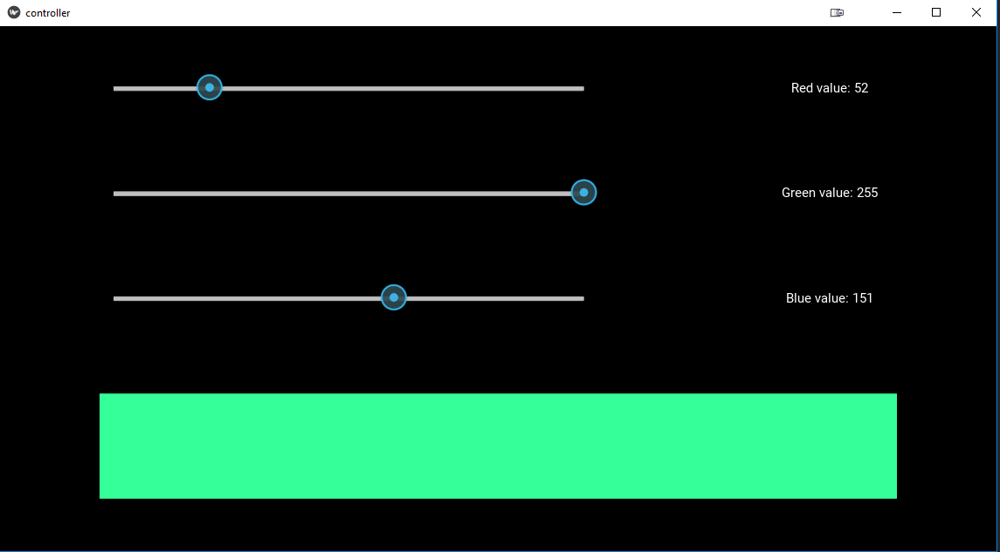

# RBG strip controller with Arduino

Resizable python app built using the Kivy framework that communicates with Arduino over serial port

----
Customizable variables:

 - 'ARDUINO_PORT' in controller.py file
 - 'RED_PIN', 'BLUE_PIN', 'GREEN_PIN' in arduino_code.ino file

## Python packages

- [kivy](https://kivy.org/docs/installation/installation-rpi.html)
- [serial](http://pyserial.readthedocs.io/en/latest/pyserial.html)

## Screenshots

## Schematic

